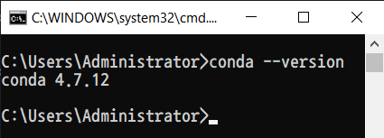
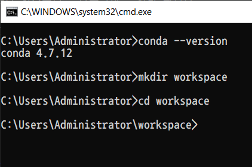
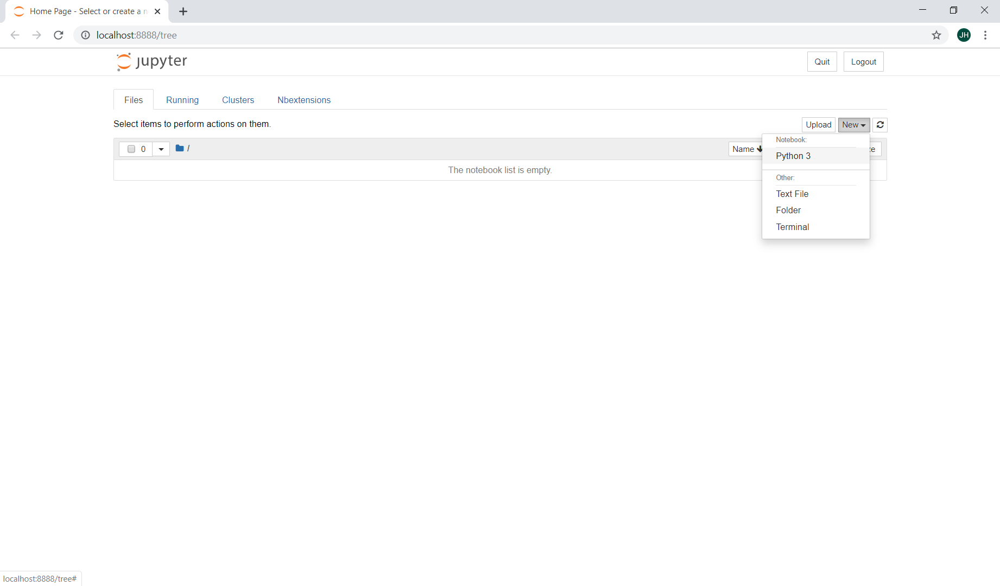
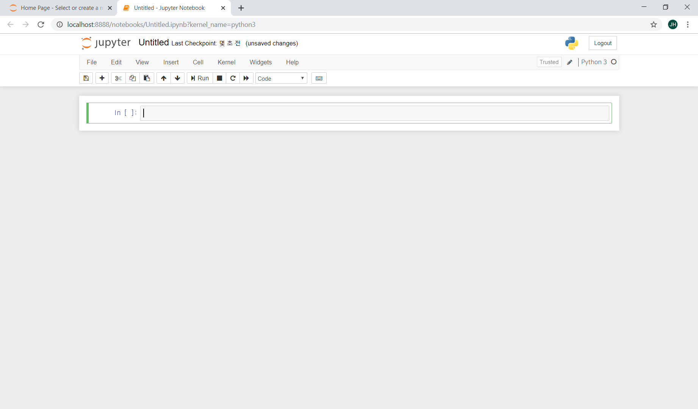
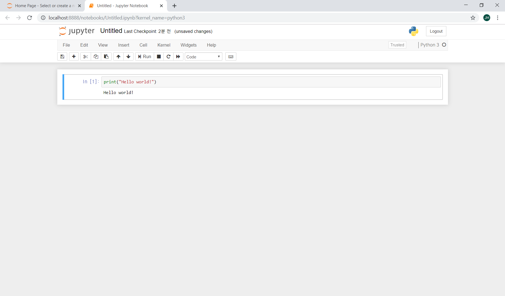

```{r setup, include=FALSE}
knitr::opts_chunk$set(echo = TRUE)
reticulate::use_python("C://Users/administrator/Anaconda3/python")
```

# 1. 목차

데이터사이언스랩 기초 파이썬 스터디 자료입니다. 전체적인 목차는 다음과 같습니다. 주어진 시간이 많지 않기 때문에 깊이있는 내용을 다루기보다는 방학 중 프로젝트를 진행할 수 있는 능력을 키우는 것에 초점이 맞추어져 있습니다.

- [01. 자료형과 연산자](https://yonseidslab.github.io/pyfords/dtype)

    - 숫자
    - 문자열
    - 불
    - 변수, 함수
    - 리스트
    - 튜플
    - 셋
    - 딕셔너리
    
- [02. 제어문, 객체지향 프로그래밍과 클래스]()

    - 반복문: for, while
    - 조건문: if, else, elif
    - 객체지향 프로그래밍과 클래스

- [03. 데이터 다루기: `numpy`&`pandas`]()

    - Array
    - Series
    - DataFrame
    - 필터링, groupby
    
- [04. 시각화: `matplotlib`, `seaborn`]()

# 2. 아나콘다 설치

## 2.1. 아나콘다 인스톨러 다운로드

아나콘다는 데이터 분석과 머신러닝을 위한 파이썬 배포판입니다. 아나콘다를 설치하면, 파이썬 언어에 더해 데이터 분석에 필요한 파이썬 패키지 및 툴들이 같이 설치된다고 생각하시면 됩니다. https://www.anaconda.com/distribution/ 에서 자신의 컴퓨터에 맞는 아나콘다 인스톨러를 다운받아 주시면 됩니다.


## 2.2. 환경변수 추가

다운로드를 진행하시다보면 다음과 같이 아나콘다를 환경 변수에 추가할 것인지 묻는 항목이 나옵니다. 추가를 체크하고 진행해주시면 됩니다.


## 2.3. 설치 점검

설치가 완료되었다면 점검을 해볼 차례입니다. 윈도우 사용자라면 `win+R` 키를 입력한 후 `cmd`를 입력하면 cmd 창을 열 수 있습니다. cmd를 열고, `conda --version`을 입력해주세요. 다음과 같이 버전이 출력된다면 무사히 설치가 완료된 것입니다. 버전이 완전히 같지 않아도 괜찮습니다.



# 3. 주피터 노트북 사용하기

## 3.1. 왜 주피터인가?

주피터 노트북은 Interactive Python을 웹 브라우저에서 사용할 수 있도록 만든 어플리케이션입니다. 개인적으로 주피터 노트북이 데이터 분석에 적합한 이유는 크게 다음 두 가지라고 생각합니다. 물론 지금 당장 와닿지 않는 장점들일 수도 있고, 코딩을 하다보면 다른 편집기들을 더 편하게 느끼실 수도 있습니다. 어떤 편집기를 사용하는지는 개인 취향이고, 자신에게 더 편한 방법이 있다면 굳이 주피터를 고집할 이유는 없습니다!

1. 인터랙티브 파이썬 환경으로 코드의 실행 결과를 즉시 확인할 수 있으며, 코드 수정 - 재실행이 편리하다.

2. 마크다운을 통해 분석 결과를 즉시 글로 정리할 수 있다.

## 3.2. 작업공간 생성

주피터 노트북을 사용하고 간단한 코드를 입력해보겠습니다. 먼저 CMD 창에서 자신이 작업할 디렉토리를 생성하고, 해당 디렉토리로 이동합니다. CMD 창에 `mkdir workspace`를 입력 후 엔터,  `cd workspace`를 입력 후 엔터 쳐주시면 됩니다. `mkdir workspace`는 `workspace`라는 디렉토리를 생성하라는 명령이고, `cd workspace`는 `workspace` 디렉토리로 이동하라는 명령어입니다. 그래픽 인터페이스에서 `workspace`라는 이름의 새 폴더를 생성하고, 해당 폴더를 여는 것과 같은 동작입니다.




## 3.3. 주피터 노트북 실행

이제 이 디렉토리에서 주피터 노트북을 실행해보겠습니다. `jupyter notebook`을 입력하면 주피터 노트북 서버가 실행됩니다. 자동으로 브라우저가 실행되지 않는다면 아래 표시된 URL 부분을 복사하여 브라우저의 주소창에 입력해주시면 됩니다.


## 3.4. 새 노트북 생성

브라우저에 주피터를 띄우는 것까지 성공했다면, 새로운 노트북을 만들 차례입니다. 우측 상단의 new > Python3를 클릭하여 새로운 노트북을 생성해주세요.





이제 주피터 노트북을 사용할 준비는 모두 끝났습니다. 셀 안에 코드를 입력하고 `Ctrl+Enter`를 입력하면 셀 안에 입력된 코드가 실행됩니다. 셀에 `print("Hello world!")`를 입력하고 실행해보세요!



## 3.5. 기타

다음은 주피터를 사용할 때 알면 좋은 단축키 목록입니다. 굳이 외우실 필요는 없습니다! 

셀 안에서(Edit mode)

- 함수 적은 후 `Shift + tab` :  툴팁 표시
- `Ctrl + Enter`: 셀 실행 
- `Shift + Enter`: 셀 실행하고 아래 셀 선택(아래 셀 없으면 셀 추가)
- `Ctrl + Shift + -`: 커서 위치에서 셀 분리
- `Ctrl + /`: 선택된 코드를 주석으로


셀 밖에서(Command mode)

- `A` : 위에 셀 삽입
- `B` : 아래에 셀 삽입
- `C` : 셀 복사
- `X` : 셀 잘라내기
- `V` : 셀 붙여넣기
- `D+D` : 선택된 셀 삭제
- `Ctrl + Shift + M`: 선택될 셀 병합
- `M` : 마크다운 셀로 변환
- `Y` : 파이썬 셀로 변환
