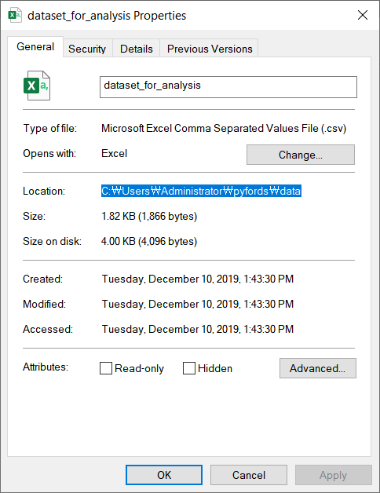

```{r setup, include=FALSE}
knitr::opts_chunk$set(echo = TRUE)
library(reticulate)
library(tidyverse)
use_python("C://User/Administrator/Anaconda3/python3")
```

- [00. 데이터 과학을 위한 파이썬](https://yonseidslab.github.io/pyfords/)
- [01. 자료형과 연산자](https://yonseidslab.github.io/pyfords/page1)
- [02. 제어문, 클래스, 패키지](https://yonseidslab.github.io/pyfords/page2)
- [03. 데이터 다루기: numpy & pandas](https://yonseidslab.github.io/pyfords/page3)
- [04. 시각화: matplotlib, seaborn](https://yonseidslab.github.io/pyfords/page4)

# Intro

`numpy`는 과학 계산을 위한 파이썬 패키지입니다. 다차원 자료구조 `ndarray`를 통해 벡터/행렬 계산 및 브로드캐스팅을 지원합니다. `pandas`는 넘파이를 기반으로 데이터 사이언스에 필요한 자료구조 및 데이터 핸들링 기능들을 제공합니다. 대표적으로 1차원 자료구조인 `Series`와 2차원 자료구조인 `DataFrame`을 지원합니다.

# 1. Numpy 튜토리얼

시작하기 전에, `numpy` 패키지를 `np`라는 이름으로 불러오겠습니다.

```{python eval=F}
>>> import numpy as np
```

## 1.1. ndarray

넘파이의 핵심은 어레이, 즉 `ndarray` 클래스입니다. 어레이는 지금까지 다룬 리스트와 유사하지만 더욱 강력한 성능과 기능을 제공합니다.  `np.array` 함수를 사용하여 `ndarray`를 만들 수 있습니다.

```{python eval=F}
>>> a = [1,2,3]
>>> np.array(a)
array([1, 2, 3])
>>> b = [4,5]
>>> np.array(b)
array([4,5])
>>> np.array([1,2,3,4,5])
array([1,2,3,4,5])
```

## 1.2. 어레이와 자료형

어레이가 포함하는 요소들은 모두 같은 자료형을 가져야만 하며, 어레이를 만들 때 `dtype` 매개변수를 활용하여 자료형을 직접 지정할 수 있습니다. 데이터 타입을 지정하지 않으면 넘파이가 자동으로 데이터 타입을 판단합니다. 만들어진 어레이의 데이터 타입을 확인할 때는 `dtype` 속성을 활용합니다. 

```{python eval=F}
>>> a = np.array([1,2,3], dtype="int8") # 내부 자료가 차지하는 메모리 직접 제한 가능
>>> a.dtype # dtype 속성을 통해 자료형에 접근 가능
dtype('int8')
```

어레이의 자료형을 변환할 때는 `astype` 메소드를 활용합니다. 괄호 안에 원하는 자료형을 적어주면 어레이를 해당 자료형으로 변환한 결과가 출력됩니다. 역시 어레이를 직접적으로 변화시키는 메소드가 아니기 때문에 결과를 저장하려면 다시 할당을 해주어야 합니다. 

<div class="row">
  <div class="col-md-6">
```{python eval=F}
>>> a = np.array([1,2,3])
>>> a.astype('str')
array(['1', '2', '3'], dtype='<U4')
```
 </div>
 <div class="col-md-6">
```{python eval=F}
>>> a = np.array([1,2,3])
>>> a.astype('float16')
array([1., 2., 3.], dtype=float16)
```
  </div>
</div>


## 1.3. n차원 어레이와 shape


**넘파이의 1차원 어레이는 하나의 행 벡터처럼 생각할 수 있습니다.** 따라서 여러 개의 1차원 어레이를 결합하면, 하나의 행렬을 만들 수 있을 것입니다. 예를 들어 $\vec{u} = (1,2,3)$ 이라는 벡터와 $\vec{v} = (4,5,6)$이라는 벡터를 두 개의 행으로 갖는 $2 \times 3$ 크기의 행렬 $A$를 넘파이로 구현해보겠습니다.

$$A = \begin{pmatrix}
 \vec{u} \\
 \vec{v} \\
 \end{pmatrix} = 
 \begin{pmatrix}
 1 & 2 & 3 \\
 4 & 5 & 6 \\
 \end{pmatrix}
 $$
<div class="row">
  <div class="col-md-6">
```{python eval=F}
>>> u = np.array([1,2,3])
>>> v = np.array([4,5,6])
>>> A = np.array([u,v])
>>> A
array([[1, 2, 3],
       [4, 5, 6]])
>>> A.shape
(2,3)
```
  </div>
  <div class="col-md-6">
```{python eval=F}
>>> A = np.array([[1,2,3],[4,5,6])
>>> A
array([[1, 2, 3],
       [4, 5, 6]])
>>> A.shape
(2,3)

```
  </div>
</div>

위 예시 코드에서 `u`와 `v`는 각각 $(1,2,3)$, $(4,5,6)$ 을 표현하는 어레이입니다. 두 개의 어레이를 다시 `np.array` 함수로 묶은 것이 `A`입니다. `shape`은 어레이의 모양을 나타내는 속성입니다. 즉 행렬로 따지면 $m \times n$ 의 사이즈를 나타냅니다. 오른쪽 코드처럼 리스트로 행렬구조를 표현하여 즉시 어레이를 만들어줄 수도 있습니다.

차수가 서로 다른 벡터들을 가지고 행렬을 만들 수 없듯이, 길이가 서로 다른 1차원 어레이를 가지고도 2차원 어레이를 만들 수 없습니다. 길이가 서로 다른 1차원 어레이들을 쌓으면 결과는 1차원 어레이들을 요소로 갖는 1차원 어레이가 됩니다.

```{python eval=F}
>>> u = np.array([1,2,3])
>>> v = np.array([4,5])
>>> A = np.array([u,v])
>>> A
array([list([1, 2, 3]), list([4, 5])], dtype=object)
>>> A.shape
(2,)
```

넘파이 배열은 3차원 이상으로도 확장될 수 있습니다. 3차원 이상의 배열로 확장할 때에도 마찬가지로 요소들의 `shape`이 일치해야 합니다. 차원이 늘어나면, `shape`의 앞쪽으로 확장된 차수가 추가됩니다.

$$A = 
 \begin{pmatrix}
 1 & 2 & 3 \\
 3 & 4 & 5 \\
 \end{pmatrix}, \space
 B = 
 \begin{pmatrix}
 5 & 6 & 7 \\
 7 & 8 & 9 \\
 \end{pmatrix}
$$

```{python eval=F}
>>> A = np.array([[1,2,3],[3,4,5]])
>>> A.shape
(2,3)
>>> B = np.array([[5,6,7],[7,8,9]])
>>> B.shape
(2,3)
>>> C = np.array([A,B])
>>> C
array([[[1, 2, 3],
        [3, 4, 5]],

       [[5, 6, 7],
        [7, 8, 9]]])

>>> >>> C.shape
(2, 2, 3)
```

위 예시 코드에서 `A`와 `B`는 각각 $2 \times 3$ 행렬입니다. `C`는 `A` 와 `B`를 쌓아서 만든 $2 \times 2 \times 3$ 텐서입니다. 즉 2개의 행렬 안에 각각 2개의 벡터가 들어있고, 각각의 벡터 안에 3개의 스칼라가 들어있는 모양입니다.

## 1.4. 어레이 인덱싱

어레이의 인덱싱 역시 대괄호`[]`와 콜론`:`을 사용합니다. 어레이 인덱싱에서 주의할 점은 인덱싱 문법이 어레이의 `shape`에 대응한다는 점입니다. 즉 `(2,3,4)`와 같은 `shape`을 갖는 어레이에서 하나의 스칼라를 인덱싱하는 경우, `[0,0,0]` 부터 `[1,2,3]` 의 인덱스 범위가 존재하게 됩니다. 여기에서는 2차원 어레이의 인덱싱까지만 다룹니다.

### 1차원 어레이

1차원 어레이의 인덱싱은 파이썬 리스트 인덱싱과 크게 다를 것 없습니다.

```{python eval=F}
>>> a = np.array([1,2,3])
>>> a[0]
1
>>> a[:2]
array([1, 2])
```

### 2차원 어레이

이번에는 2차원 어레이의 인덱싱을 다루어 보도록 하겠습니다. 먼저 행렬 $A$ 에 대응하는 2차원 어레이 `A`를 아래와 같이 구현해보겠습니다.

$$A = 
 \begin{pmatrix}
 1 & 2 & 3 \\
 4 & 5 & 6 \\
 \end{pmatrix}
$$

```{python eval=F}
>>> A = np.array([[1,2,3],[4,5,6]])
>>> A
array([[1, 2, 3],
       [4, 5, 6]])
```

2차원 어레이에서 하나의 스칼라를 인덱싱할 때에는 `A[행인덱스,열인덱스]`과 같이 쓰면 됩니다. 즉 2행 1열의 요소를 인덱싱히려면 다음과 같이 쓰면 됩니다. 파이썬의 인덱스는 `0`부터 시작하기 때문에 `[2,1]`이 아니라 `[1,0]`이 됩니다.

```{python eval=F}
>>> A[1,0]
3
```

이번에는 슬라이싱을 적용해서 세 번째 열 전체를 가져와보겠습니다. 전체 행에 대해서 세 번째 열의 요소만들 가져오므로 구간은 `[:,2]`와 같이 표현합니다.

```{python eval=F}
>>> A[:,2]
array([3, 6])
```

:::warning
**예제 1.1. 어레이 A에서 4와 5를 인덱싱해보세요.**

```{python eval=F}
>>> A = np.array([[1,2,3],[4,5,6]])
```

**풀이**

두 번째 행 벡터에서 두 번째 요소까지를 가져오면 되는 문제입니다. 따라서 구간은 [1,:2]가 됩니다.

```{python eval=F}
>>> A[1,:2]
array([4, 5])
```
:::

## 1.5. 어레이 연산

### 같은 쉐입의 연산

어레이의 쉐입이 같을 때, `+`, `-`, `*`, `-`, `**` 등 기본 연산은 같은 위치의 원소들끼리 연산한 결과를 반환합니다.

```{python eval=F}
>>> u = np.array([1,2,3])
>>> v = np.array([4,5,6])
```

<div class="row">
  <div class="col-md-6">
**덧셈**
```{python eval=F}
>>> u + v
array([5, 7, 9])
```
  </div>
  <div class="col-md-6">
**뺄셈**
```{python eval=F}
>>> u - v
array([-3, -3, -3])
```
  </div>
</div>

<div class="row">
  <div class="col-md-6">
**곱셈**
```{python eval=F}
>>> u * v
array([ 4, 10, 18])
```
  </div>
  <div class="col-md-6">
**나눗셈**
```{python eval=F}
>>> u / v
array([0.25, 0.4 , 0.5 ])
```
  </div>
</div>


### 다른 `shape`의 연산: 브로드캐스팅


넘파이는 서로 다른 쉐입의 자료들 간에도 연산을 지원합니다. 물론 모든 어레이들이 서로 호환되는 것은 아니며, 한 쪽 어레이의 쉐입이 다른 쪽 어레이의 쉐입으로 확장될 수 있는 경우에만 연산이 가능합니다. 2차원까지의 어레이에 한정하여 말하면 다음과 같은 경우들입니다. 여기에서는 스칼라 연산의 결과만을 확인해보겠습니다.

- 스칼라와 벡터, 스칼라와 행렬 간의 연산
- $m \times n$ 행렬과 $m \times 1$ 벡터 간의 연산
- $m \times n$ 행렬과 $1 \times n$ 벡터 간의 연산
 - $m \times 1$ 벡터와 $1 \times n$ 벡터 간의 연산

<div class="row">
  <div class="col-md-6">
**덧셈**

```{python eval=F}
>>> a = np.array([1,2,3])
>>> a + 3
array([4, 5, 6])
```
  </div>
  <div class="col-md-6">
**뺄셈**
```{python eval=F}
>>> a = np.array([1,2,3])
>>> a - 1
array([0, 1, 2])
```
  </div>
</div>

<div class="row">
  <div class="col-md-6">
**곱셈**

```{python eval=F}
>>> a = np.array([1,2,3])
>>> a * 3
array([3, 6, 9])
```
  </div>
  <div class="col-md-6">
**나눗셈**
```{python eval=F}
>>> a = np.array([1,2,3])
>>> a / 2
array([0.5, 1. , 1.5])
```
  </div>
</div>

## 1.6. 기타 함수와 메소드

### numpy 함수

- `np.dot` : 두 벡터의 내적을 계산
- `np.matmul` : 두 행렬의 곱을 계산
- `np.pow` : 배열 내 요소들의 n승
- `np.sqrt` : 배열 내 요소들의 제곱근

### ndarray 메소드

- `ndarray.transpose` : 전치
- `ndarray.reshape` : shape 재배열

# 2. Pandas

시작하기 전에, `pandas`를 `pd`라는 별칭으로 불러오겠습니다.

```{python echo=F}
import numpy as np
import pandas as pd
```

```{python eval=F}
>>> import pandas as pd
```

## 2.1. Series & DataFrame

### 시리즈와 데이터프레임

판다스의 핵심은 1차원 자료형 클래스 `Series`, 2차원 자료형 클래스 `DataFrame`입니다. 시리즈와 데이터프레임은 각각 넘파이의 1차원 어레이, 2차원 어레이에 더욱 다양한 기능들을 추가하여 만들어졌습니다. **시리즈는 대부분의 경우 하나의 열, 변수, 피쳐를 나타내며, 여러 개의 시리즈들을 한데 묶은 것이 데이터프레임입니다.** 아래 그림은 `apples`, `oranges`라는 두 개의 컬럼이 하나의 데이터프레임을 이루는 모습입니다. 이를 실제 파이썬 코드로 구현해보겠습니다.


```{python eval=F}
>>> data = {
...     'apples': [3, 2, 0, 1], 
...     'oranges': [0, 3, 7, 2]
... }
>>> purchases = pd.DataFrame(data, index=['June', 'Robert', 'Lily', 'David'])
>>> purchases
```

```{python echo=F}
data = {
    'apples': [3, 2, 0, 1], 
    'oranges': [0, 3, 7, 2]}
purchases = pd.DataFrame(data, index=['June', 'Robert', 'Lily', 'David'])
purchases
```

데이터프레임을 만들 때에는 `pd.DataFrame` 클래스 안에 딕셔너리를 넣어줍니다. 이 때 딕셔너리의 키는 컬럼의 이름어야 하고, 값은 컬럼에 실제로 들어갈 요소들이어야 합니다. 행 인덱스가 필요하다면 `index` 파라미터에 행 인덱스로 사용할 값들을 넣어주면 됩니다. 

:::warning
**예제 2.1. 아래와 같은 데이터프레임을 만들어주세요.**

```{python echo=F}
pd.DataFrame(
    {"학점":["A","B","C","A"], "학년":[3,3,1,2]}
)
```

**풀이**

데이터프레임은 학점, 학년이라는 두 개의 컬럼으로 이루어져 있습니다. 따라서 딕셔너리의 키 값은 `"학점"`,`"학년"`이 됩니다. 학점의 값은 `["A","B","C","A"]` 이고, 학년의 값은 `[3,3,1,2]`입니다. 따라서 데이터프레임을 이루는 딕셔너리는 다음과 같이 만들어졌을 것입니다.

```{python eval=F}
>>> data = {"학점":["A","B","C","A"], "학년":[3,3,1,2]}
```


이 결과를 `pd.DataFrame`으로 감싸주면 데이터프레임이 완성됩니다.

```{python eval=F}
>>> pd.DataFrame(data)
```

:::

## 2.2. 외부 데이터 읽어오기

판다스로 데이터프레임을 직접 만들 수도 있지만, 대부분의 경우에는  `csv`, `xlsx`, `json` 등 파일로 저장된 외부 데이터를 읽어와 작업을 하게 됩니다. **앞으로 가장 많이 접하게 될 `csv` 파일을 읽어오는 함수는 `pd.read_csv` 입니다.** 가장 먼저 파일이 위치한 경로를 입력하고, `encoding` 매개변수에 파일의 인코딩을 지정해줍니다. `utf-8`이 기본 옵션이므로 `utf-8` 파일을 읽어올 때에는 따로 인코딩을 지정할 필요가 없습니다. 

```{python eval=F}
>>> data = pd.read_csv("data/dataset_for_analysis.csv", encoding="ANSI")
>>> data = data.set_index("사례번호")
>>> data # 출력 생략
```

:::warning
**예제 2.2. 아래 링크의 csv 파일을 판다스로 읽어오세요.**

https://raw.githubusercontent.com/agconti/kaggle-titanic/master/data/train.csv

**풀이**

판다스는 웹에 존재하는 파일을 즉시 읽어올 수도 있습니다.

```{python eval=F}
>>> titanic = pd.read_csv(
        "https://raw.githubusercontent.com/agconti/kaggle-titanic/master/data/train.csv"
... )
>>> titanic.head() # 출력 생략
```
:::

:::warning
### 경로와 인코딩

**절대경로 상대경로, 인코딩**이 무엇인지 아시면 이 내용은 건너뛰셔도 됩니다. 

#### 경로

.|.
---|---
|

**경로는 파일이 존재하는 위치를 뜻하며 절대 경로, 상대 경로로 나누어 생각할 수 있습니다.** 절대 경로는 최상위 디렉토리인 `C:` 부터 시작하는 경로인 반면, 상대 경로는 특정 디렉토리를 기준으로 상대적으로 표현된 경로입니다. 위에서 우리가 읽어들인 `dataset_for_analysis.csv` 파일을 예로 들어 보겠습니다. 먼저 해당 파일이 존재하는 위치로 가서, 파일의 속성을 확인해봅니다. 그러면 위와 같은 화면을 확인할 수 있을 것입니다. 이 때 Location 항목에 표시되는 것이 파일이 위치한 디렉토리의 절대 경로이며, 파일의 절대 경로는 `C:\Users\Administrator\pyfords\data\dataset_for_analysis.csv` 가 됩니다.

```
# 계층적으로 표현한 디렉토리 구조
C:/
    Users/
        Administrator/
            pyfords/
                data/
                    dataset_for_analysis.csv
                    gapminder.csv
                    iris.csv
```

하지만 위의 예시 코드에서는 입력한 경로는 `C:` 부터 출발하지 않는 **상대 경로**입니다. 상대 경로를 통해서 파일을 읽어올 수 있었다는 것은 분명히 기준 경로가 존재한다는 뜻입니다. 파일의 절대 경로와 상대 경로를 비교해보면, 파이썬이 인식하는 기준 경로가 `C:\Users\Administrator\pyfords\` 임을 알 수 있습니다. 만약 주피터 노트북을 사용하고 계신다면, 현재 열려있는 노트북이 실행된 위치가 기준 디렉토리가 됩니다. 파이썬 표준 패키지인 `os`를 이용하면 현재 작업중인 기준 디렉토리를 확인할 수 있습니다.

```{python eval=F}
>>> import os
>>> os.getcwd()
'C:\Users\Administrator\pyfords'
```

#### 인코딩

컴퓨터는 숫자만을 저장할 수 있습니다. 따라서 우리가 사용하는 문자들을 컴퓨터에 파일로 저장하기 위해서는 문자를 코드로 바꾸어주는 일종의 변환이 필요합니다. 이러한 변환 과정을 인코딩이라고 합니다. 반대로 인코딩된 자료를 해독하여 다시 사람이 이해할 수 있는 문자로 바꾸어주는 것을 디코딩이라고 합니다. 

문제는 인코딩에 하나의 통일된 체계가 존재하지 않는다는 점입니다. 예를 들어 `euc-kr`이라는 규칙으로 인코딩된 파일을 `utf-8`이라는 규칙으로 디코딩하려고 한다면 어떻게 될까요? 당연히 정상적으로 해독이 되지 않을 것입니다. 흔히 말해 '글자가 깨지는' 현상이 나타나거나, 혹은 아예 파일을 읽어오지 못할 것입니다. 이러한 경우에는 컴퓨터가 파일의 인코딩 규칙에 맞게 디코딩을 할 수 있도록, 파일이 어떠한 규칙으로 인코딩되었는지 알려주어야 합니다.
:::

# 3. 판다스 기본기

이제 본격적으로 판다스 데이터프레임을 조작하는 방법을 배워보도록 하겠습니다. 크게 아래와 같은 기능들을 학습할 것입니다. 사실 판다스의 `DataFrame`은 R의 `data.frame`을 모방해서 만들어졌고, 아래 조작들은 R의 패키지 `dplyr`의 핵심 동사들이 제공하는 기능들입니다. 아래 조작들을 판다스에서 어떻게 구현할 수 있는지 차근차근 배워보겠습니다.

- 변수 선택: 데이터프레임의 특정 칼럼을 추출
- 필터링: 특정 기준을 만족하는 행을 추출
- 정렬: 행을 다시 정렬
- 변수 추가: 새로운 변수를 추가
- 변수 요약: 변수를 값(스칼라)으로 요약
- 그룹별로 조작: 데이터프레임을 범주형 변수의 수준별로 묶어서 조작

## 3.1. 변수 선택

변수를 선택한다는 것은 결국 데이터프레임에서 특정 열만을 뽑아내는 작업입니다. 변수 선택은 다음과 같은 두 가지 방법으로 실행할 수 있습니다. 속성을 사용하는 것이 타이핑은 편하지만, 변수명에 띄어쓰기나 점`.` 등이 포함되거나 기타 속성과 겹칠 경우 사용할 수 없습니다. 대괄호와 문자열을 사용해서 열을 인덱싱하는 방법은 어떠한 경우에도 사용할 수 있습니다.

<div class="row">
  <div class="col-md-6">
```{python eval=F}
>>> data['명칭']
사례번호
1     노동법 개정 반대 시위
2      카탈루냐 분리독립시위
3         노란 조끼 시위
4        브렉시트 반대시위
.
.
.
Name: 명칭, dtype: object
```
  </div>
  <div class="col-md-6">
```{python eval=F}
>>> data.명칭
사례번호
1     노동법 개정 반대 시위
2      카탈루냐 분리독립시위
3         노란 조끼 시위
4        브렉시트 반대시위
.
.
.
Name: 명칭, dtype: object
```
 </div>
</div>

방법|예시코드|비교
---|---|---
열 인덱싱| `data['명칭']` | 타이핑 귀찮지만 범용성 높음
속성 추출|`data.명칭` | 타이핑 편하지만 범용성 낮음

### 복수 개의 열 인덱싱

**복수 개의 열을 뽑아낼 때에는 대괄호`[]` 안에 열 이름의 리스트를 넣어줍니다.** 

```{python eval=F}
>>> data[['국가','명칭', '당해 GDP 성장율']] # 대괄호 안에 리스트가 들어있습니다
         국가            명칭  당해 GDP 성장율
사례번호
1      이탈리아  노동법 개정 반대 시위    0.240000
2       스페인   카탈루냐 분리독립시위    1.370000
3       프랑스      노란 조끼 시위    1.724881
4        영국     브렉시트 반대시위    1.390000
.
.
.
```

:::warning
**예제 3.1. 판다스 데이터프레임의 `columns` 속성을 통해 데이터프레임의 컬럼 이름들에 접근할 수 있습니다. 위에서 읽어온 `titanic` 데이터의 컬럼 이름을 확인하고, 원하는 컬럼을 추출해보세요.

```{python eval=F}
>>> titanic.columns
Index(['PassengerId', 'Survived', 'Pclass', 'Name', 'Sex', 'Age', 'SibSp',
       'Parch', 'Ticket', 'Fare', 'Cabin', 'Embarked'],
      dtype='object')
```
:::

## 3.2. 필터링 

### 필터링의 원리: 마스킹

```{python eval=F}
>>> 데이터프레임[조건식]
>>> data[data.국가 == "이탈리아"]
>>> titanic[titanic.Age > 30]
```

필터링은 특정 변수에 대해 원하는 조건을 만족하는 행을 걸러내는 조작입니다. 기본적으로는 위와 같은 형식을 따르며, 이 때 `조건식`은 결국 `True`와 `False`만으로 이루어진 불리언 시리즈입니다. 위에서 만들어둔 `purchases` 데이터를 예로 들어보겠습니다. 

```{python eval=F}
>>> purchases
        apples  oranges
June         3        0
Robert       2        3
Lily         0        7
David        1        2
```

위 데이터에서 **사과를 1개 이상 산 사람들만을 걸러내고자 한다**면 어떻게 해야 할까요? 먼저 사과 구매에 해당하는 변수인 `apples`를 선택해야 합니다. 다음으로 `purchases.apples` 에 대해서, 각각의 값이 0 보다 큰지를 판단해주면 됩니다. 연산을 실행한 결과는 `True`와 `False`로 이루어진 불리언 시리즈입니다. 이러한 연산이 가능한 것은 넘파이의 브로드캐스팅 때문입니다.

<div class="row">
  <div class="col-md-6">
**1. 변수 선택**
```{python eval=F}
>>> purchases.apples
June      3
Robert    2
Lily      0
David     1
Name: apples, dtype: int64
```
  </div>
  <div class="col-md-6">
**2. 조건 판단: 브로드캐스팅**
```{python eval=F}
>>> purchases.apples > 0
June       True
Robert     True
Lily      False
David      True
Name: apples, dtype: bool
```
 </div>
</div>


$$ Numpy \space Broadcasting: 
\begin{pmatrix}
3 > 0\\
2 > 0\\
0 > 0\\
1 > 0\\
\end{pmatrix}
=
\begin{pmatrix}
True\\
True\\
False\\
True\\
\end{pmatrix}
$$

이제 이 결과를 통해 행을 인덱싱해주면 끝입니다. 데이터프레임 옆에 대괄호`[]`를 적고, 대괄호 안에 완성된 불리언 시리즈를 넣어주면, 조건이 `True`인 행들만 추출됩니다. 데이터 프레임 위에 `True`, `False`로 된 시리즈를 덧붙여서 `True`만 남긴다고 생각하시면 됩니다.

<div class="row">
  <div class="col-md-6">
```{python eval=F}
>>> purchases[purchases.apples > 0]
        apples  oranges
June         3        0
Robert       2        3
David        1        2
```

  </div>
  <div class="col-md-6">
Index|apples|oranges|apples > 0
---|---|---|---
June|3|0|True
Robert|2|3|True
~~Lily~~|~~0~~|~~7~~|~~False~~
David|1|2|True
  </div>
</div>
