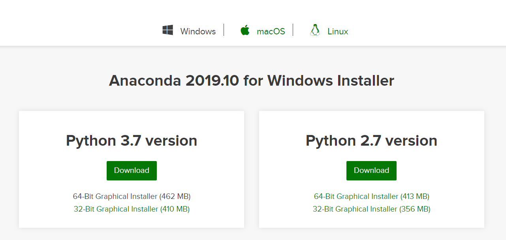

```{r setup, include=FALSE}
knitr::opts_chunk$set(echo = TRUE)
reticulate::use_python("C://Users/administrator/Anaconda3/python")
```

# 목차

데이터사이언스랩 기초 파이썬 스터디 자료입니다. 전체적인 목차는 다음과 같습니다. 주어진 시간이 많지 않기 때문에 깊이있는 내용을 다루기보다는 방학 중 프로젝트를 진행할 수 있는 능력을 키우는 것에 초점이 맞추어져 있습니다.

- [01. 자료형과 연산자](https://jhgan00.github.io/pybasic/dtype)

    - 숫자, 문자열, 불 & 기본 연산자
    - 리스트, 튜플, 딕셔너리 & 기본 연산자
    - 변수
    
- [02. 제어문]()

    - 조건문: if, else, elif 
    - 반복문: while, for

- [03. 데이터 다루기: `pandas`]()

    - Series & DataFrame
    - 필터링
    - 기술통계와 요약
    
- [04. 시각화: `matplotlib`, `seaborn`]()

# [아나콘다](https://www.anaconda.com/)

아나콘다는 데이터 분석과 머신러닝을 위한 파이썬 배포판입니다. 즉 아나콘다를 설치하면, 파이썬 언어에 더해 데이터 분석에 필요한 패키지 및 환경들이 같이 설치된다고 생각하시면 됩니다. https://www.anaconda.com/distribution/ 에서 자신의 컴퓨터에 맞는 아나콘다를 다운받아 주시면 됩니다.



